# Ghosty Contracts

## ERC721
This is a collection of solidity NFT smart contracts by [@ghooost0x2a](https://twitter.com/ghooost0x2a).

For now, only ERC721 contract is provided. ERC1155 might be added in the future.

### Why?

Many people seem to be using manifold nowadays, and although they are doing a great job, their contracts are not perfect. For one, they have not yet implement the OpenSea RegistryFilter required for Royalties to be respected on OS sales.
My contract is also full of features, customizable and easy to use.

### Features

The contract was built by combining mutliple contracts and features from various places. It is based on the Ultra gas optimized ERC721B contract by @squuebo_nft integrated with the LockRegistry (2FA) contracts by @OwlOfMoistness (more on this later) and heavily modified and tested. Here are some of the features:
* **Ultra Low Gas**
* **2FA**
* **Access Control/Delegation**
* **Pausable**
* **OpenSea RegistryFilter/Royalties Compliant**
* **Set default and per token royalties**
* **Set/Update your token URI/metadata**
* **Mint to your own wallet or do airdrops to your collector wallets directly**
* **Possibility of locking up the collection (so no more minting can be done)**
* **Supports batch transfers**

### Deployment Steps
Note that the full deployment tutorial starts with deploying to Goerli testnet. If you want to deploy to mainnet directly (I recommend deploying to testnet at least once), please skip directly to the **Deploying on Mainnet** section.

*Note these steps were all done on desktop Metamask using Chrome. That being said, they should work on any desktop browser.*

#### Deploying on Goerli testnet
1. Enable Test Networks in your metamask
2. Get Goerli testnet ETH
3. Setup RemixIDE
4. Deploy to Goerli testnet
5. Test contract/minting on Goerli testnet

#### Deploying on Mainnet
1. Setup RemixIDE
2. Deploy to Goerli testnet
3. Test contract/minting on Goerli testnet
4. Configure your contract
5. Configure your metadata

#### Deploying on Goerli testnet
##### 1. Enable Test Networks in your metamask
In metamask Settings > Advanced, enable **Show test networks**
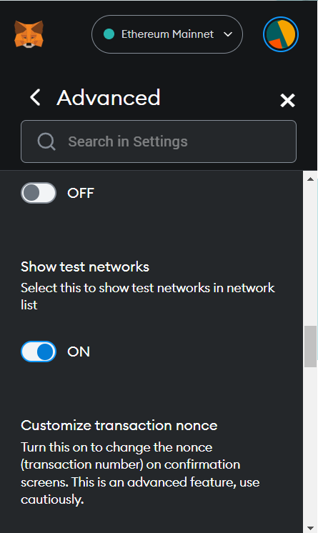

##### 2. Get Goerli testnet ETH
1. First of all, create a FREE Alchemy account by going to **https://auth.alchemy.com/signup**.
2. Once your account is created, go to **https://goerlifaucet.com/**, connect your newly created Alchemy account.
3. Enter your wallet address (the one you will deploy the contract from) and click **Send me ETH**
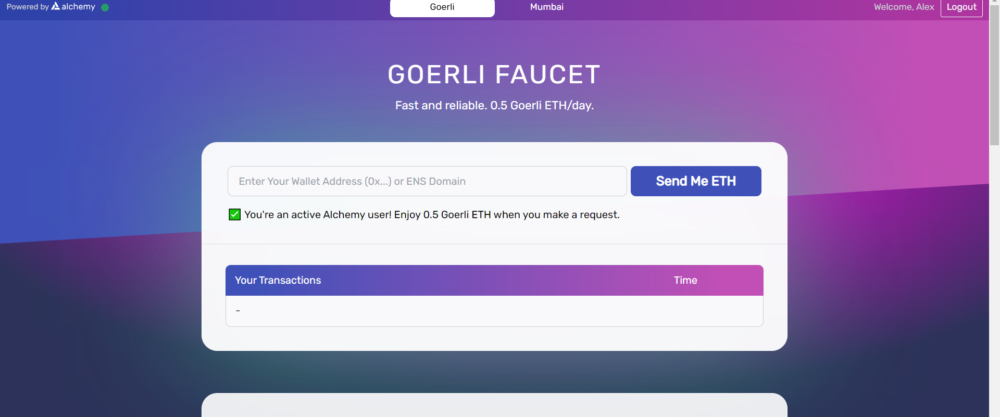
4. In metamask, switch your network to **Goerli test network** and confirm you received 0.5 Goerli ETH.
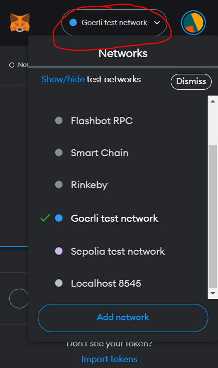
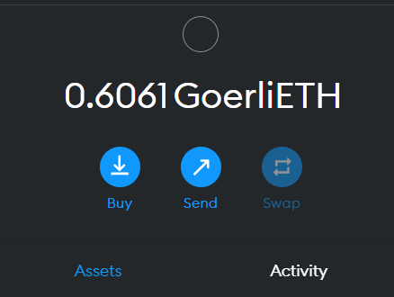

##### 3. Setup RemixIDE 
RemixIDE is an online solidity development platform. It has all the necessary features to easily compile and deploy smart contracts, verify them, interact with them, etc.

1. Open this page in a new tab, **https://github.com/ghooost0x2a/ghosty_contracts**, click on **Code** and **Download as ZIP**
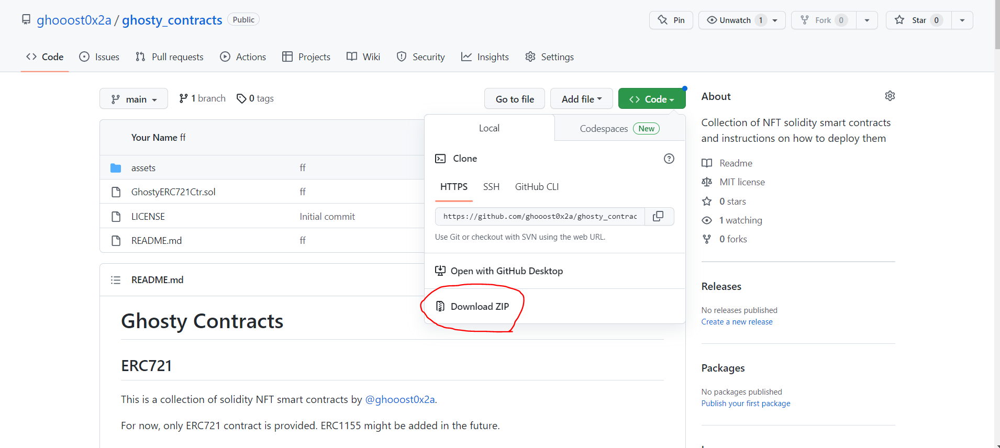
2. Unzip the **ghosty_contracts-main.zip** file you just downloaded. You should end up with a folder containing all the files.

3. Go to **https://remix.ethereum.org/**. Delete everything in the **contracts** folder (in the left pane).
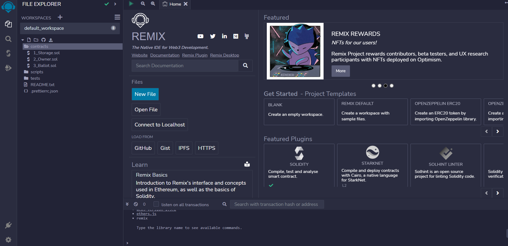
4. Select the **contracts** folder, and click on the little **Upload** icon. Go to the unzipped folder and select the **GhostyERC721Ctr.sol**
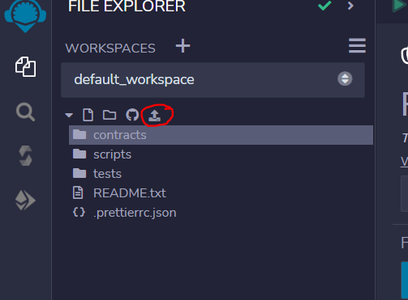
5. (Optional) You can delete or change the ASCII art at the top of the contract. Only delete the selected text (in the screenshot below), make sure not to delete the /\*\*\* at the top. *Note that in solidity, multi-line comments start with /\*\*\* and end with \*/. In remix, comments appear as green text.*
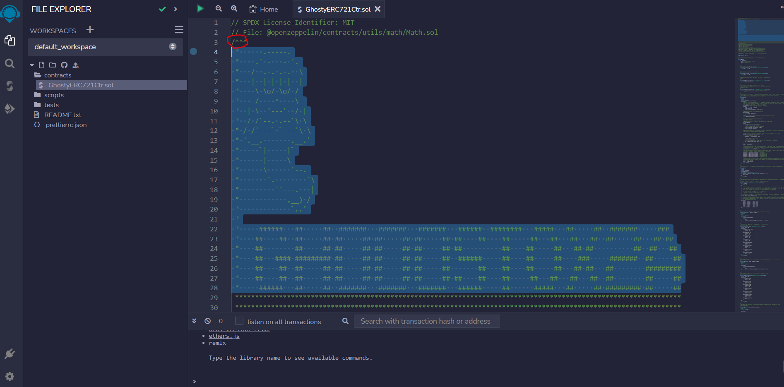
6. In the **GhostyERC721Ctr.sol** file, search for the following text '**GhostyERC721Ctr_NAME_TO_REPLACE**'. Change that to the name of your collection. Then search for the text '**G0x2a**' and replace that with the token symbol you want (this is a 2-4 character code that will use to identify the token/NFT on the blockchain. For example: A15, DS, DD, etc.)
7. (Optional) Search for '**uint256 public MAX_SUPPLY = 10000**' in the contract (should be just above the ones from step #6). Change the value (10000) to the maximum size of your collection. Note that you are better off putting a bigger number now and reducing it afterwards. Once the contract is deployed, you will unable to mint more than MAX_SUPPLY tokens and that value cannot be increased AFTER the contract has been minted. 
8. Click on the editor and click **CTRL+S** to save the changes. 
##### 4. Deploy to Goerli testnet
1. On the left-hand menu in RemixIDE, click on the third icon, the **Solidity Compiler**
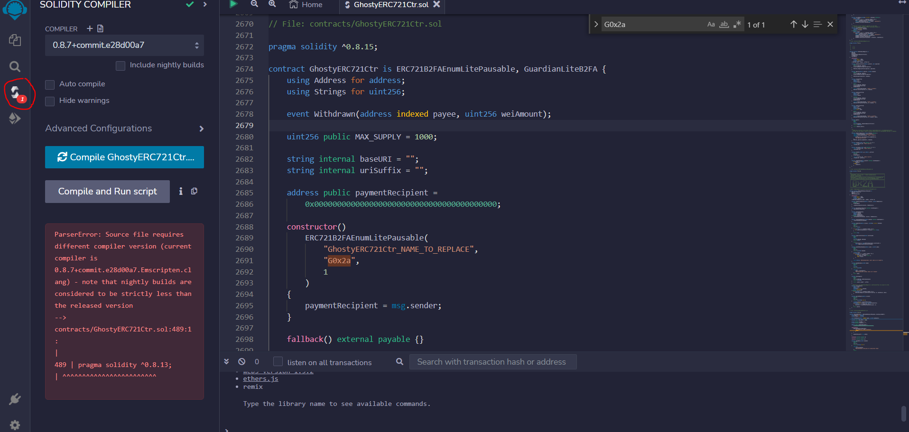
2. At the top, in the **Compiler** dropdown, select the second option from the top (highest version that doesn't start with *latest local...*)
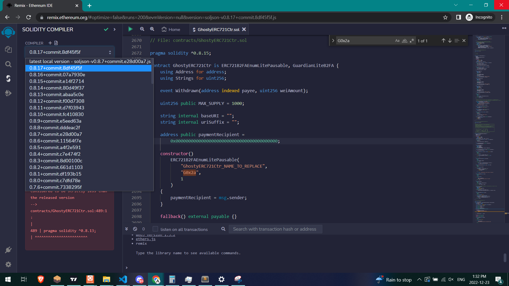
3. Click on **Advanced Configuration** and check the **Enable optimization** checkbox. Then click on the big blue **Compile GhostyERC721...** button.
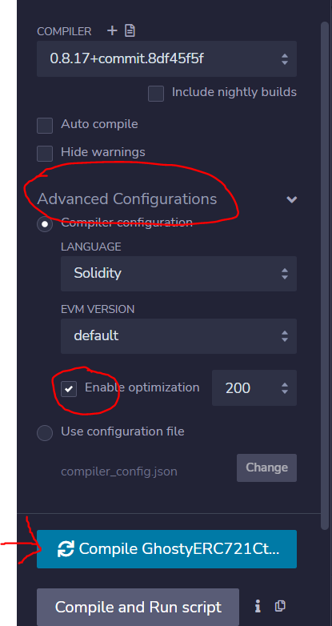
4. If the compiler was showing any errors before, they should now have disappeared. The left-hand menu should show a green check mark.
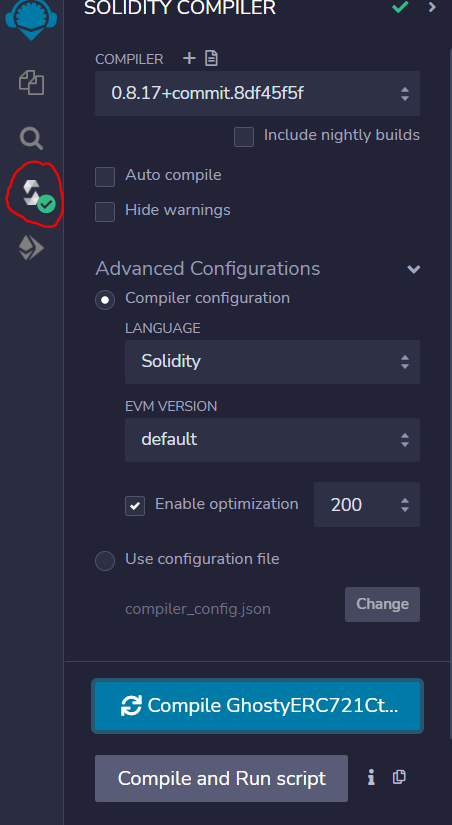
5. On the left-hand menu, go to the 4th icon, **Deploy & Run transactions**. On the **Environment** dropdown, select *Inject Provider - MetaMask* (make sure your metamask is on the Goerli Network). The small text under the drodown should say *Goerli (5) network*. In the **Contract** dropdown, select the contract named '**GhostyERC721Ctr - contracts/GhostyERC721Ctr.sol**' (it's important to select the rigth contract. The name should start with GhostyERC721Ctr).
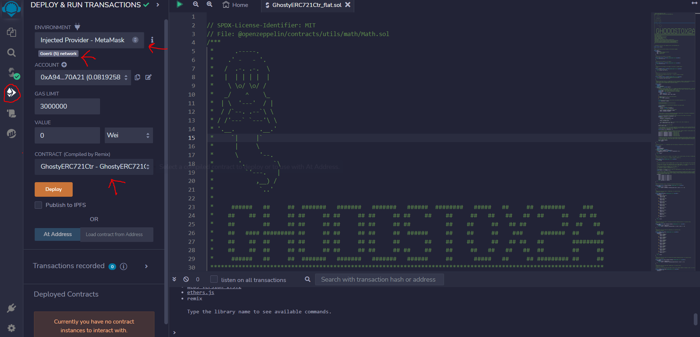
6. Click on **Deploy** and confirm the transaction in the MetaMask popup. Once the transaction finishes, you will see a message at the bottom of the RemixIDE window. Click on **view on etherscan**.
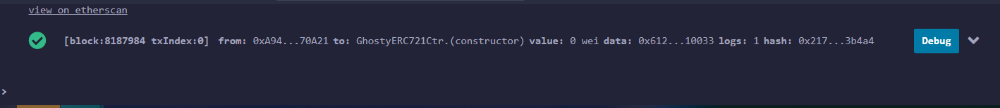
7. On the etherscan transaction page, click on the Contract address (this might take a while to appear, just refresh the page until it does). This will bring you to the etherscan contract page. 
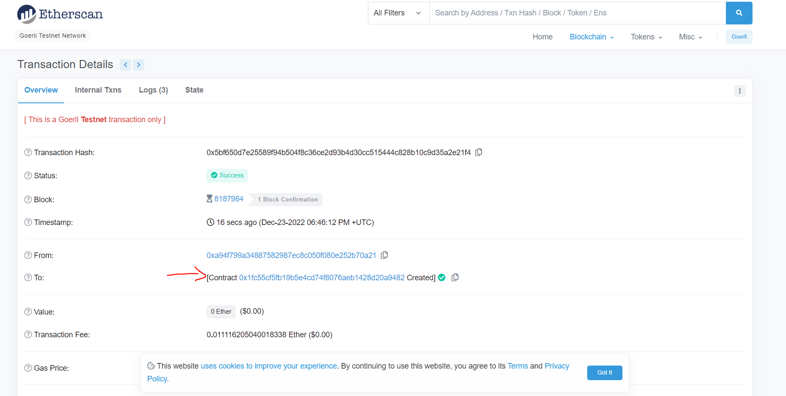
8. On the Etherscan page, click on **Contract** and then **Verify and Publish**.
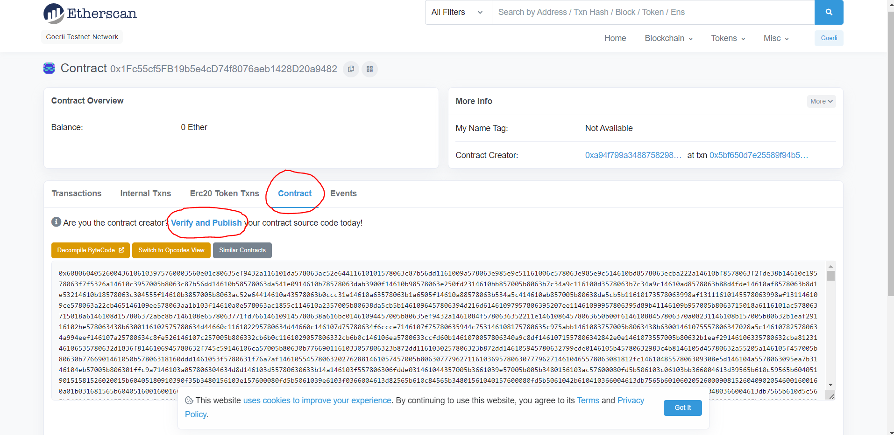
9. On the following page, For **Compiler Type** put *Solidity single file*. For **Compiler version**, select the same version as used in step #2, above. For the **License Type**, select *3) MIT License (MIT)*. Click on **Continue**

10. On the next page, on the right, set the **Optimization** to *Yes*. Go back to RemixIDE, and copy the whole contract code (CTRL+A and CTRL+C). Paste that code on the Etherscan page, in the **Enter the solidity Contract Code below** text field. Scroll at the bottom and click on **Verify and Publish**. This might take a few minutes...
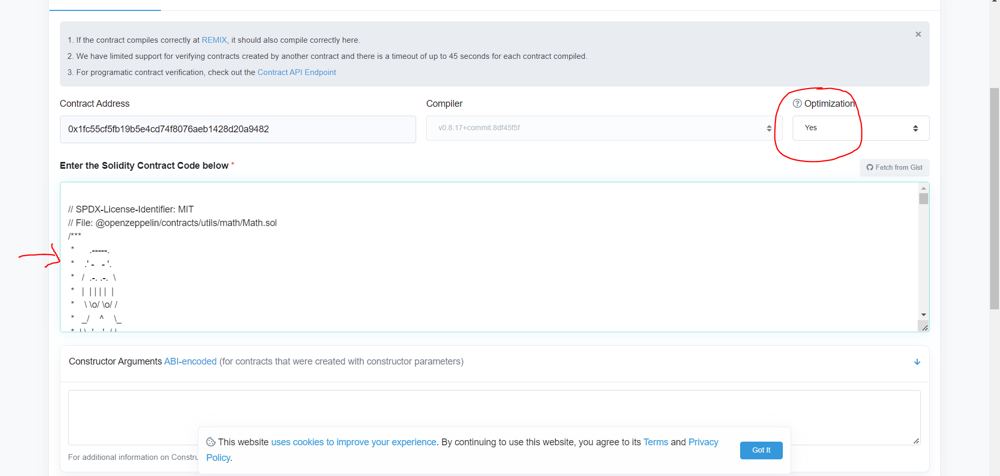
11. Once the verification is completed, Etherscan will show you a message like **Successfully generated ByteCode and ABI for Contract Address [...]**. You can click on the **Contract address** to get back to your contract code page.
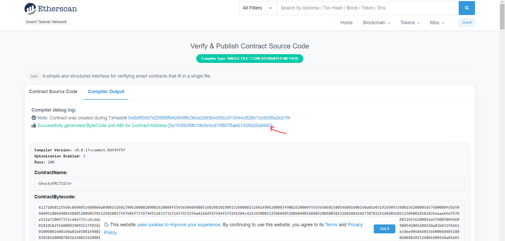
12. On your Etherscan contract page, you should now see a green check mark next to the **Contract** tab. If you click on it, you should also see 3 new buttons, **Code**, **Read Contract** and **Write Contract**. This confirms that your contract source code was successfully verified. Congrats!
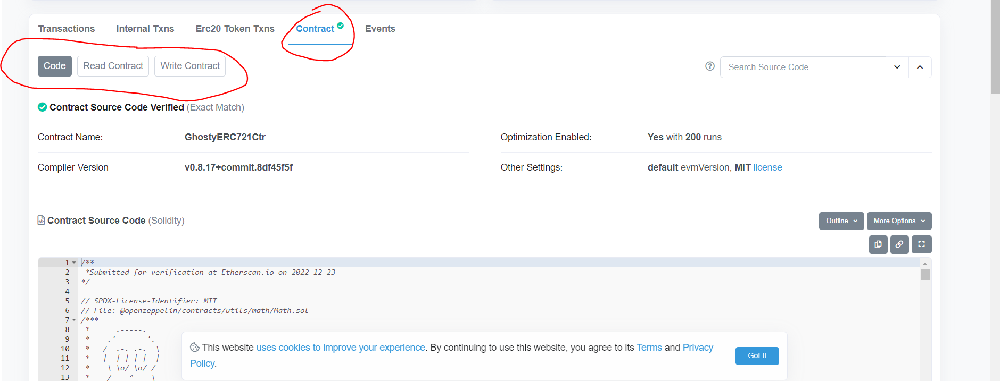

##### 5. Test contract/minting on Goerli testnet
Now that our contract is deployed and verified, let's interact with it. This is mainly done on Etherscan itself.
1. Go to your Etherscan contract page and click on **Contract**, **Write Contract**. Then click on **Connect to Web3**. Make sure to connect with the same address you used to deploy the contract. 
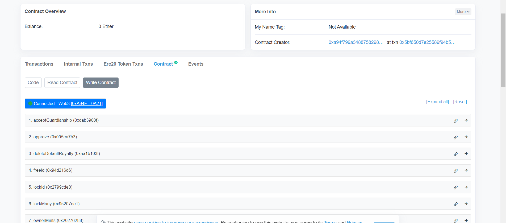
2. Click on function #7 **ownerMints**, and in quantity set **1** and for recipients set **\[YOUR_OWN_ADDRESS\]** (make sure to replace the YOUR_OWN_ADDRESS with your actual address between \[square brackets\]). Click on **Write** and approve the transaction in the Metamask popup.
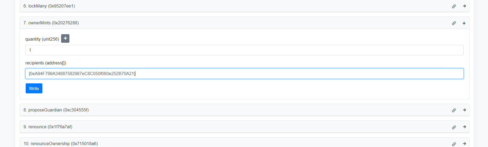
3. Go to OpenSea testnet page (https://testnets.opensea.io/) and search for your contract address. Make sure to wait for OpenSea dropdown and click on the search result (not on the looking glass or ENTER). Note, this will only work AFTER you minted at least 1 token.
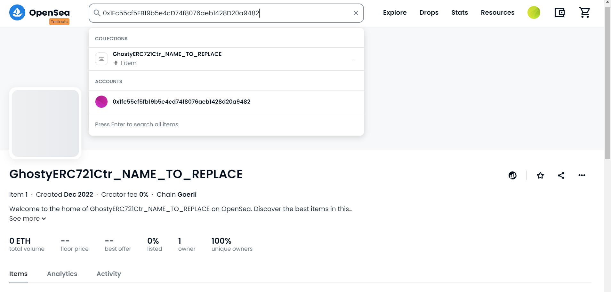

CONGRATULATIONS! You deployed your own contract to Goerli testnet. If you are ready to deploy to Mainnet, please read on.

