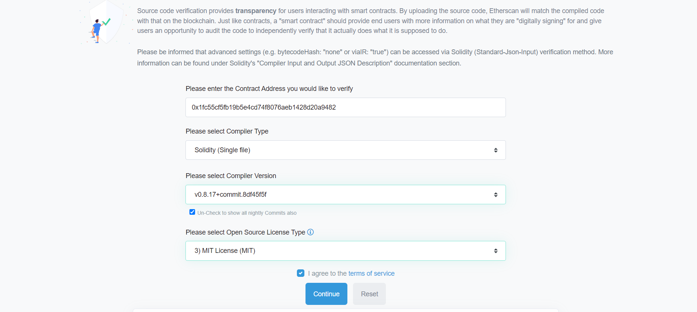
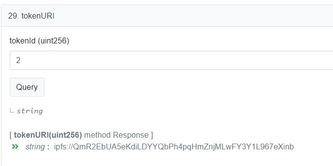

# Ghosty Contracts

# ERC721
This is a collection of solidity NFT smart contracts by [@ghooost0x2a](https://twitter.com/ghooost0x2a).

For now, only ERC721 contract is provided. ERC1155 might be added in the future.

## Why?

The motivation behind is project is to offer NFT creators/artists an alternative solution for their smart contract deployment. Instead of minting your NFTs on some markeplace contract you do not own or using other solutions like manifold that are more limited in terms of features, I am providing my **GhostyERC721Ctr.sol** contract for anyone who would like to use it. 

The tradeoff is complexity. Going this way is a bit more complicated than using manifold or lazy minting, BUT I believe it is worth it (see list of features below). The good news is, I have provided a very detailed guide below, as well as video demos. If you read it all, you will likely get a better understanding of how smart contracts work and will be able to easily deploy and interact with your own contract. Once you understand the process, you can easily deploy as many contracts/collections as you want.

## Features

The contract was built by combining mutliple contracts and features from various places. It is based on the Ultra gas optimized ERC721B contract by @squuebo_nft integrated with the LockRegistry (2FA) contracts by @OwlOfMoistness (more on this later) and heavily modified and tested. Here are some of the features:
* **Ultra Low Gas**
* **Access Control/Delegation**
* **Pausable**
* **OpenSea RegistryFilter/Royalties Compliant**
* **Set default and per token royalties**
* **Set/Update your token URI/metadata**
* **Mint to your own wallet or do airdrops to your collector wallets directly**
* **Possibility of locking up the collection (so no more minting can be done)**
* **Supports batch transfers**
* **2FA**

## Table of Contents
Note that the full deployment tutorial starts with deploying to Goerli testnet. If you want to deploy to mainnet directly (I recommend deploying to testnet at least once), please skip directly to the **[Deploying on Mainnet](#deploying-on-mainnet-1)** section.

*Note these steps were all done on desktop Metamask using Chrome. That being said, they should work on any desktop browser.*

### [Deploying on Goerli testnet](#deploying-on-goerli-testnet-1)
1. [Enable Test Networks in your metamask](#1-enable-test-networks-in-your-metamask)
2. [Get Goerli testnet ETH](#2-get-goerli-testnet-eth)
3. [Setup RemixIDE](#3-setup-remixide)
4. [Deploy to Goerli testnet](#4-deploy-to-goerli-testnet)
5. [Test contract/minting on Goerli testnet](#5-test-contractminting-on-goerli-testnet)

***This is the [link](https://goerli.etherscan.io/address/0x6f027405bb6d0088209abba85dd69c3594fab875#code) to the Goerli tesnet contract deployed in this documentation.***

### [Deploying on Mainnet](#deploying-on-mainnet-1)
1. [Setup RemixIDE](#1-setup-remixide)
2. [Deploy to Mainnet](#2-deploy-to-mainnet)
3. [Test contract/minting](#3-test-contractminting)

### [Interacting with your Contract]()
*This section is important in order to understand how the contract works and how to use the various features.*
1. [Smart Contracts General Info]()
2. [Minting info]()
3. [Access Control/Delegation]()
4. [Configure metadata]()
5. [Reduce collection size/Lock Minting]()
6. [Setting roylaties on contract]()
7. [Extra READ functions]()
8. [Extra WRITE functions]()


### Deploying on Goerli testnet
#### 1. Enable Test Networks in your metamask
In metamask Settings > Advanced, enable **Show test networks**


#### 2. Get Goerli testnet ETH
1. First of all, create a FREE Alchemy account by going to **https://auth.alchemy.com/signup**.

2. Once your account is created, go to **https://goerlifaucet.com/**, connect your newly created Alchemy account.

3. Enter your wallet address (the one you will deploy the contract from) and click **Send me ETH**


4. In metamask, switch your network to **Goerli test network** and confirm you received 0.5 Goerli ETH.


#### 3. Setup RemixIDE 
RemixIDE is an online solidity development platform. It has all the necessary features to easily compile and deploy smart contracts, verify them, interact with them, etc.

1. Open this page in a new tab, **https://github.com/ghooost0x2a/ghosty_contracts**, click on **Code** and **Download as ZIP**


2. Unzip the **ghosty_contracts-main.zip** file you just downloaded. You should end up with a folder containing all the files.


3. Go to **https://remix.ethereum.org/**. Delete everything in the **contracts** folder (in the left pane).


4. Select the **contracts** folder, and click on the little **Upload** icon. Go to the unzipped folder and select the **GhostyERC721Ctr.sol**


5. (Optional) You can delete or change the ASCII art at the top of the contract. Only delete the selected text (in the screenshot below), make sure not to delete the /\*\*\* at the top. *Note that in solidity, multi-line comments start with /\*\*\* and end with \*/. In remix, comments appear as green text.*


6. In the **GhostyERC721Ctr.sol** file, search for the following text '**GhostyERC721Ctr_NAME_TO_REPLACE**'. Change that to the name of your collection. Then search for the text '**G0x2a**' and replace that with the token symbol you want (this is a 2-4 character code that will use to identify the token/NFT on the blockchain. For example: A15, DS, DD, etc.)

7. (Optional) Search for '**uint256 public MAX_SUPPLY = 10000**' in the contract (should be just above the ones from step #6). Change the value (10000) to the maximum size of your collection. Note that you are better off putting a bigger number now and reducing it afterwards. Once the contract is deployed, you will unable to mint more than MAX_SUPPLY tokens and that value cannot be increased AFTER the contract has been minted. 

8. Click on the editor and click **CTRL+S** to save the changes. 
#### 4. Deploy to Goerli testnet
1. On the left-hand menu in RemixIDE, click on the third icon, the **Solidity Compiler**


2. At the top, in the **Compiler** dropdown, select the second option from the top (highest version that doesn't start with *latest local...*)


3. Click on **Advanced Configuration** and check the **Enable optimization** checkbox. Then click on the big blue **Compile GhostyERC721...** button.


4. If the compiler was showing any errors before, they should now have disappeared. The left-hand menu should show a green check mark.


##### 5. Deploying
On the left-hand menu, go to the 4th icon, **Deploy & Run transactions**. On the **Environment** dropdown, select *Inject Provider - MetaMask* (make sure your metamask is on the Goerli Network). The small text under the drodown should say *Goerli (5) network*. In the **Contract** dropdown, select the contract named '**GhostyERC721Ctr - contracts/GhostyERC721Ctr.sol**' (it's important to select the rigth contract. The name should start with GhostyERC721Ctr).


6. Click on **Deploy** and confirm the transaction in the MetaMask popup. Once the transaction finishes, you will see a message at the bottom of the RemixIDE window. Click on **view on etherscan**.


7. On the etherscan transaction page, click on the Contract address (this might take a while to appear, just refresh the page until it does). This will bring you to the etherscan contract page. 


8. On the Etherscan page, click on **Contract** and then **Verify and Publish**.


9. On the following page, For **Compiler Type** put *Solidity single file*. For **Compiler version**, select the same version as used in step #2, above. For the **License Type**, select *3) MIT License (MIT)*. Click on **Continue**



10. On the next page, on the right, set the **Optimization** to *Yes*. Go back to RemixIDE, and copy the whole contract code (CTRL+A and CTRL+C). Paste that code on the Etherscan page, in the **Enter the solidity Contract Code below** text field. Scroll at the bottom and click on **Verify and Publish**. This might take a few minutes...


11. Once the verification is completed, Etherscan will show you a message like **Successfully generated ByteCode and ABI for Contract Address [...]**. You can click on the **Contract address** to get back to your contract code page.


12. On your Etherscan contract page, you should now see a green check mark next to the **Contract** tab. If you click on it, you should also see 3 new buttons, **Code**, **Read Contract** and **Write Contract**. This confirms that your contract source code was successfully verified. Congrats!


#### 5. Test contract/minting on Goerli testnet
Now that our contract is deployed and verified, let's interact with it. This is mainly done on Etherscan itself.
1. Go to your Etherscan contract page and click on **Contract**, **Write Contract**. Then click on **Connect to Web3**. Make sure to connect with the same address you used to deploy the contract. 


2. Click on function #7 **ownerMints**, and in quantity set **1** and for recipients set **\[YOUR_OWN_ADDRESS\]** (make sure to replace the YOUR_OWN_ADDRESS with your actual address between \[square brackets\]). Click on **Write** and approve the transaction in the Metamask popup.


3. Go to OpenSea testnet page (https://testnets.opensea.io/) and search for your contract address. Make sure to wait for OpenSea dropdown and click on the search result (not on the looking glass or ENTER). Note, this will only work AFTER you minted at least 1 token.


**CONGRATULATIONS! You deployed your own contract to Goerli testnet. If you are ready to deploy to Mainnet, please read on.**

### Deploying on Mainnet

#### 1. Setup RemixIDE
1. Switch your Metamask network to ETH Mainnet.
2. Repeat step 3 of the Goerli testnet instructions **[Setup RemixIDE](#3-setup-remixide)**. **If you already did this step for the Goerli testnet deployment, you can skip it**

#### 2. Deploy to Mainnet
1. Repeat step 4 of the Goerli testnet instructions **[Deploy to Goerli testnet](#4-deploy-to-goerli-testnet)** BUT at **[step 5](#5-deploying)**, make sure that under the **Environment** it says *Main (1) network*.


#### 3. Test contract/minting
4. Repeat step 5 of the Goerli testnet instructions **[Test contract/minting on Goerli testnet](#5-test-contractminting-on-goerli-testnet)**. Just make sure your wallet is on the **Mainnet** network. *Also, in step 3, instead of going to the OS test page, you can go to the regular **[OpenSea](https://opensea.io/)***


### Interacting with your Contract


#### 1. Smart Contracts General Info
What is a smart contract anyway? 
Simply put, a smart contract is a program (written in solidity language), stored on the blockchain. This program is stored at a given address (called the contract or collection address) created at the moment of the contract deployment on the blockchain.
The program contains variables and functions (procedures). Once a contract is deployed on the blockchain, we can interact with it, aka read and modify its variables and call its functions. 

A DAPP (Decentralized APP) is simply a web2 website with code allowing it to interact with the blockchain and call the functions on a given contract. It serves as the GUI for interacting a contract. So when an NFT project deploys a smart contract, they will typically create a DAPP that will allow its community to mint the NFTs. The DAPP simply sends calls to the mint function on the smart contract, on behalf of the user who then approves those calls/interactions in their wallet (e.g. Metamask).

This documentation does not cover DAPP creation. That subject is a more complex subject and the GhostyERC721Ctr contract only has one mint function reseved to the owner/deployer of the contract. As mentioned, DAPPs are simply user interfaces to interact with a smart contract, but there are other ways to do that. The easiest is using etherscan directly. When we deploy and verify our smart contract, etherscan gives us access to its variables and functions. We can simply call the contract functions (like mint), from etherscan itself, without any DAPPs.


#### 2. Minting info

As mentioned this contract has only one minting function called **ownerMints**. This function can only be used/called by the owner/creator of the contract, and his chosen delegates (see next section for more info on delegates).

The **ownerMints** function takes two parameters (arguments/variables). In other words, when we call this mint function, we need to give it two pieces of information, namely the **quantity** of NFTs we would like to mint, and the **recipients** of those NFTs aka the address(es) where we want to send those NFTs. 

This mint function, can be used two ways; **Minting to a SINGLE wallet** or doing an **Airdrop to MULTIPLE wallets** 


##### Minting to a SINGLE wallet
Use this method to mint one or multiple NFTs to a ***SINGLE*** wallet (that you own). In order to do this, you enter the **quantity** you want (number of NFTs) and for **recipients**, you put one of your OWN wallet \[addresses\] (DO NOT PUT THE CONTRACT ADDRESS). This could be the same address you used to deploy the contract, or another one that you own. This is basically the address where all the (**quantity**) NFTs will be sent once minted.

**Make sure that the \[address\] is between square brackets, this is IMPORTANT! (see example screenshot)**

* *Of course, this function will fail if you are not connected to etherscan with an authorized address (either the owner/creator or a delegate address).*

* *Another potential failure reason is if you are busting the MAX_SUPPLY you set in the contract during deployment. MAX_SUPPLY is the absolute maximum amount of NFTs that can ever exist in this collection. You can view its value by goign to the **Read Contract** tab, and clicking on MAX_SUPPLY* 


##### Airdrop to MULTIPLE wallets
Use this method to mint/airdrop NFTs to ***MULTIPLE*** wallets. In order to do this, you provide the **quantity** and for **recipients**, a ***LIST*** of addresses (not just one), separated by commas (,) and between \[square brackets\].

**VERY IMPORTANT!** This method will mint ONE nft to EACH address provided in the list. This means that the number of addresses provided in the list must exactly match the **quantity** number. If you want to mint/airdrop more than one to the same address, simply put that same address multiple times in your **recipients** list. That person will get as many NFTs as times their address appears in the **recipients** list.

**Examples**

***Airdropping 3 NFTs to 3 different persons***


***Airdropping 2 NFTs to 1 person, and 2 to 2 other persons***

As we can see in the screenshot below, the first (1) and second (2) address highlighted in yellow are one and the same. This means that it gets dropped 2 NFTs. Addresses 3 and 4 are both different, and they each get dropped 1 NFT for a total **quantity** of 4.


#### 3. Access Control/Delegation
The **GhostyERC721Ctr** contract implements the **OWNABLE** (Common OpenZeppelin library) functionality. This is a common thing for ERC721 contracts. This functionality defines an **OWNER** address. This is used to restrict the access of some of our smart contract functions, like the mint function. The **ownerMints** is restricted, otherwise anyone could mint NFTs on your contract for free. This is also used to restrict other functionality like setting/changing the metadata, the MAX_SUPPLY (size of the collection), and so on. By default, the owner of a contract is the address/person that deploys it on the blockchain.

On top of the **Ownable** feature, this contract also implements **DELEGATES**. These are additional addresses, configured by the **OWNER** (only) that have access to restricted functions like mint, setting MAX_SUPPLY, setting metdata, etc. 

An address designated as **DELEGATE** has the ALL the permissions that the **OWNER** has **EXCEPT** for the ability to designate other delegates. Only the **OWNER** of the contract can set and remove delegates.

There are two main reasons for using delegates; If you are collaborating on a project with someone, and you want to give them access to mint and control the contract OR, if you want to give delegation to another one of your OWN addresses, for convenience (for instance, you deploy the contract from your ledger, but you delegate one of your metamask addresses to be able to mint from it).

##### Add/Remove delegate
In order to add a new delegate address, first go to Write Contract on Etherscan, and **Connect to Web3** with the **OWNER** wallet (the one you deployed from). Scroll down and click on function #18 **setDelegate**. For **addr** field, enter the address you would like to set as delegate (cannot be the contract address nor the **OWNER** address). For the **isDelegate_** field set the value to **true** and click on **Write**.

If you want to *remove* a previous delegate, simply put **false** in the **isDelegate_** field.


##### Check if an address is a delegate
On Etherscan, switch to the **Read Contract** tab, scroll down to function #9 **isDelegate**. Enter the address you want to check and click on **Query**. This will return true or false.


#### 4. Configure metadata
An NFT's metadata is not stored on the blockchain. The smart contract is simply text/code that dictates who owns what NFT in the collection. The contract has a function called **tokenURI** which returns the URI to the metadata of a given token number. In other words, it tells us the location of the metadata for a specific token in that collection, based on the token number. The metadata is a json file (a text file) containing information about the NFT; i.e. Description, title, image_url, attributes/traits, etc. 

Marketplates like OpenSea and Foundation (or any other NFT marketplace), interact with your smart contract by calling the **tokenURI** function for every token in your collection. It then uses the result that our smart contract returns, which will be a link to our json/text file. OS will then look into that file, find the image_url and use that to show you the NFT image/art. It will also get the attributes, title and description from that same json/text file.

What is important to understand here is that the blockchain, the smart contract, is not aware of your metadata or image. The json/text files and images are uploaded separately and independently of the smart contract itself, typically to a decentralized storage like IPFS or arweave. Once uploaded, we will update the **tokenURI** function on our smart contract to point to our freshly uploaded json/text files (which in turn will point to our images).

##### Uploading your files to IPFS (free)

There are many IPFS providers out there and most of them offer a free IPFS tier with limits on the number of files/storage size. This is perfect for one of one artists, as the amount of data is small compared to a generative project. For this documentation, we will use Filebase (https://filebase.com/). Their free tier allows for 5 GB of storage and 1000 pinned files (more than enough). 

1. Start by creating a free account on https://filebase.com/. Once you confirm your email and login, yoou should see the Filebase dashboard 


2. (Close the Welcome popup) On the left-hand menu, click on **Buckets** and then click on the orange **Create Bucket** button at the top right of the page. Give it a unique name, something related to your project/collection. This will be used to upload all the data for all the NFTs on this contract. The **Storage Network** should remain *IPFS (Always public)*.


3. Once the Bucket is created, click on it's name, then at the top right corner, click on the **New Folder** button. Name that folder **images**.


4. Upload your image(s) into the newly created **images** folder, by clicking on the orange **Upload** button at the top-right, and selecting **File**. You can then upload mutliple images at once.


5. Now that your images are uploaded, we can create our json/text metadata. We will have to create a json/text file for each NFT. Start by opening a text editor (any will do). Paste the following text/json in your editor:

```
{
    "name": "{NAME_OF_YOUR_NFT}",
    "description": "{DESCRIPTION_OF_NFT}",
    "image": "{LINK_TO_NFT_IMAGE}",
    "edition": {NFT_NUMBER},
    "attributes": [
        {
            "trait_type": "{ATTRIBUTE_1}",
            "value": "{VALUE_1}"
        },
        {
            "trait_type": "{ATTRIBUTE_2}",
            "value": "{VALUE_2}"
        },
    ],
}
```

Now we will have to edit that text for our corrent NFT. (*Let's assume we are creating the metadata for NFT 2*):
* **{NAME_OF_YOUR_NFT}** = This is the name of the NFT that appears at the top, on marketplaces (OS, FND, etc.). *See screenshot below*
* **{DESCRIPTION_OF_NFT}** = This is the long(er) description text of the NFT. Most marketplaces allow for *[markdown](#nft-description-markdown)* text in this field.  *See screenshot below*
* **{LINK_TO_NFT_IMAGE}** = This is the link to our NFT's image/art. The one uploaded on filebase earlier. For this field, we need to get the CID of our image from filebase. You can click on the little copy button next to the image for this particular NFT. Then, the value of this field becomes:
```ipfs://QmNq6VZMD4ErFSc6t7U3eAkTTFpfABg8yQ7pTHQsYo5XGk```


* **{NFT_NUMBER}** = This is the number/tokenID of this particular NFT. In this exmaple, it is 4. ***Note that unlike the other fields, this one DOES NOT need "quotes" around it**
* **attributes** = These are the NFT attributes/traits that appear on various marketplaces *See screenshot below*. They are optional, if you don't want to set any attributes, you can simply delete everything between \[the square brackets\] (but make sure to leave the empty square brackets). You can also add/remove attributes by adding/deleting these blocks:
```
        {
            "trait_type": "{ATTRIBUTE_1}",
            "value": "{VALUE_1}"
        },
```
You also need to change the values of **{ATTRIBUTE_1}** and **{ATTRIBUTE_2}** to the trait NAME(s) and the **{VALUE_1}** and **{VALUE_2}** to the trait values. 


***So in our example, above, our final json/text file for NFT #2 would like like:***
```
{
    "name": "this is my nft title #2",
    "description": "This is my nft description",
    "image": "ipfs://QmNq6VZMD4ErFSc6t7U3eAkTTFpfABg8yQ7pTHQsYo5XGk",
    "edition": 2,
    "attributes": [
        {
            "trait_type": "Accessories",
            "value": "Cyborg Peel1"
        },
        {
            "trait_type": "Avril",
            "value": "Pink"
        },
        {
            "trait_type": "Background",
            "value": "4"
        },                             
    ],
}
```

Save the file to something like **nft_#2.json** on your computer (note the *.json* file extension)

6. Repeat step #5 for all the NFTs you have minted. Make sure to change the title, the edition number, THE IMAGE URL, etc. Once you have all you ***.json*** files saved on your local computer, we are ready to upload them to filebase. 

7. On the left-hand menu, click on **Buckets** and then click on your bucket (ghosty-ctr in the screenshots). You should only have one folder in here, called **images**. Create a new folder called **json** and open it (click on it). Upload all the ***.json*** files you created in step #5 and #6 in this folder here.


8. Go to **[Updating the metadata on the contract](#updating-the-metadata-on-the-contract)** in order to update the tokenURI on the contract.

##### Updating the metadata on the contract
Now that our images AND our json/text files (metadata) have been uploaded to IPFS, we need to update our contract to point to them.

1. Go to https://etherscan.io/ (if you are doing this on Goerli testnet, go to https://goerli.etherscan.io/) and go to your contract (address), click on **Contract** and click on **Write Contract**. If you are doing this on testnet, make sure to put your Metamask on Goerli network and click on **Connect to Web3**.

2. Scroll down to function #22 **setTokenURI**, and click on it. For each NFT we have minted on the contract, we will need to call this function to set the tokenURI. Let's start with token/NFT #1. So in this case, we would put ***1*** in the first field *tokenId*. For the second field, the *_tokenURI* we need the CID value of our json/text file we uploaded to Filebase earlier. You can get it by going to **Buckets**, clicking on your bucket, then clicking on the *json* folder. In there, you need to copy the **CID** of the json/text file that represents NFT #1 in your collection. And for the value of *_tokenURI* on etherscan, we put ***ipfs://{CID}***, for example:
```
ipfs://QmY9pYwjLC1isrmR6P3xMmswwB9dWCLaVCE9Xyrq1gdoy6/
```


3. Repeat step #2 for each NFT you minted. Make sure to copy the correct ***CID*** from filebase, the one that corresponds to the NFT you are doing.

4. Once set, you can confirm the **tokenURI** is correct by switching to **Read Contract** (on etherscan). Scroll down to function #29 *tokenURI* and click on it. Put **1** in the *tokenId* field and click on **Query**. This should return the **ipfs://{CID}** link that you set specifically for NFT #1. 





#### 5. Reduce collection size/Lock Minting
The absolute maximum size of your collection is defined by the **MAX_SUPPLY** variable in your contract. You can view its current value on etherscan (by going to **Read Contract** and clicking on **MAX_SUPPLY**).

If your collection reaches the max supply value, minting will be stopped. You can never have more NFTs than this max value. After a contract has been deployed to the blockchain, the **MAX_SUPPLY** value **CANNOT BE INCREASED** it can only be *reduced* (descreased). This means you are better off setting a bigger **MAX_VALUE** when you initially mint the contract and reduce it afterwards if you want.

Why would you want to reduce your collection size (MAX_SUPPLY)? The main motivation behind this is to lock/stop the minting and freeze the collection size. Say you have released 30 NFTs in this collection, and you are done with it, you do not plan on making new NFTs in this particular collection. Well, you could then reduce the **MAX_SUPPLY** to 30. This would lock the collection, so no one would be able to mint more NFTs on this particular contract (not even the owner/creator). This is usually to reassure collectors that the supply of a given NFT collection will not suddenly increase in the future (which would make the value of existing NFTs decrease).

To reduce the **MAX_SUPPLY**, you need to go on https://etherscan.io/ (or https://goerli.etherscan.io/ if you are doing this on testnet), go to **Write Contract**, **Connect to Web3** and scroll down to function #20 **setReducedMaxSupply**. Enter the new size of your collection, and click **Write**.

**Note that the new size of the collection CANNOT be bigger than the current *MAX_SUPPLY* value or smaller than the current size of the collection (current number of minted NFTs)**


#### 6. Setting roylaties on contract
On some marketplaces, royalties need to be set directly on the marketplace, when you cofigure your collection. That being said, nowadays, most marketplaces implement the token royalties from the contract itself (if it is written in the contract, of course).

There are **TWO** ways to set royalties; default and individual roaylties.

##### Default Royalty
I ALWAYS recommend setting the default royalty first. This is the royalty that will be applied to ALL NFTs, unless you specifically set a different one for individual NFT(s). 

1. Go to etherscan, **Write Contract** and **Connect to Web3**. Scroll down to function #17 **setDefaultRoyalty**. For the ***receiver*** field, your own wallet address. This is where the royalties will be sent. 

2. For the second field, *feeNumerator*, we put the royalty value. The royalty is calculated by diving by 10000 (instead of 100). This means that if you want 5% royalty, the *feeNumerator* will be 500, if you want 7% royalties, the *feeNumerator* will be 700, and so on (you mutliply the % value you want by 100).


##### Individual (per NFT) royalty
If you want some specific tokens to have a different royalty (or no royalty at all), we can use the **setTokenRoyalty** function #21. Just like for the *Default Royalty*, we put the same type of values for *receiver* and *feeNumerator* and we put a specific *tokenId*.

*Note, you can put 0 for the feeNumerator if you want a particular token to have 0% royalties*


##### Checking your token royalties
In order to check/confirm that your royalties have been properly set, you can go on etherscan, on **Read Contract** and scroll down to function #24 **royaltyInfo** and click on it. For *_tokenId* enter the number of an NFT and for *_salesPrice* enter a fictious amount like 100.

*In the screenshots below, we see that the royalty for token #2 is 7%. This is the **Default Royalty**. The other screenshot, for NFT #1 shows 0% royalty because for token #1 we set a specific/individual royalty that overrides the **Default** one.* 


On the **Contract** tab on etherscan, we see 3 submenus; 
* **Code** = This is where you can see the whole smart contract code.
* **Read Contract** = This is where we can read the state/configuration of our contract. The functions in this section do not require you to **Connect to Web3** nor pay any gas fees, since they do NOT change the state of the blockchain (we do not write anything to our smart contract, we simply read its values).
* **Write Contract** = This is where we can change/update the state/configuration of our contract (minting, setting royalties, setting metadata, etc). We need to be **Connect to Web3** on etherscan, with the owner wallet (or a delegated address). Calling these functions require gas. 

#### 6. Extra READ functions
Outside of all the **Read functions** discussed in the various sections above, here are a few extra ones that might be useful;
* **balanceOf** = You put an ehterscan address in here, and it will tell you how many NFTs of this collection that address has
* **paused** = Tells use whether the contract is paused (True) or not (False). When the contract is paused, NFT transfers are also paused (blocked) 
* **totalSupply** = The total amount of minted NFTs so far
* **walletOfOwner** = Returns a (comma separated) list of NFTs owned by a particular address/wallet

#### 7. Extra WRITE functions
* **deleteDefaultRoyalty** = deletes the default royalty information
* **resetTokenRoyalty** = deletes the individual/specific royalty information of a given token/NFT
* **safeTransferFrom** = This is to transfer/send NFTs between wallets. We specify the *from* wallet, the *to* wallet and the tokenId. This can only be called by the owner of the NFT (not the contract owner) or an approved operator.
* **togglePaused** = Used to pause (true) or unpause (false) the contract/transfers. Possible values are ***true*** or ***false*** (all small caps)
* **transferBatch** = This works just like **safeTransferFrom** but for multiple NFTs at once. Of course, you must own ALL of those NFTs you are trying to batch transfer (or be approved). For the *tokenIds* field, we provide a \[comma, spearated, list\] of values (e.g. [1, 2, 3]) between scare brackets. For the *data* fiels, simply put ***0x0***.


## ANNEX
### NFT description Markdown
OpenSea and most other NFT markeplaces support *text markdown* in the NFT description field. Markdown is a lightweight markup language for creating formatted text using a plain-text editor. This means bold, italic text, headers, lists, links, etc...


You can view an example NFT description [here](https://opensea.io/assets/ethereum/0xd07dc4262bcdbf85190c01c996b4c06a461d2430/88386). The json/text metadata description for this NFT is below:

```
  "description": "# Markdown Cheat Sheet\n\nThanks for visiting [The Markdown Guide](https://www.markdownguide.org)!\n\nThis Markdown cheat sheet provides a quick overview of all the Markdown syntax elements. It can’t cover every edge case, so if you need more information about any of these elements, refer to the reference guides for [basic syntax](https://www.markdownguide.org/basic-syntax) and [extended syntax](https://www.markdownguide.org/extended-syntax).\n\n## Basic Syntax\n\nThese are the elements outlined in John Gruber’s original design document. All Markdown applications support these elements.\n\n### Heading\n\n# H1\n## H2\n### H3\n\n### Bold\n\n**bold text**\n\n### Italic\n\n*italicized text*\n\n### Blockquote\n\n> blockquote\n\n### Ordered List\n\n1. First item\n2. Second item\n3. Third item\n\n### Unordered List\n\n- First item\n- Second item\n- Third item\n\n### Code\n\n`code`\n\n### Horizontal Rule\n\n---\n\n### Link\n\n[title](https://www.example.com)\n\n### Image\n\n\n\n## Extended Syntax\n\nThese elements extend the basic syntax by adding additional features. Not all Markdown applications support these elements.\n\n### Table\n\n| Syntax | Description |\n| ----------- | ----------- |\n| Header | Title |\n| Paragraph | Text |\n\n### Fenced Code Block\n\n```\n{\n  \"firstName\": \"John\",\n  \"lastName\": \"Smith\",\n  \"age\": 25\n}\n```\n\n### Footnote\n\nHere's a sentence with a footnote. [^1]\n\n[^1]: This is the footnote.\n\n### Heading ID\n\n### My Great Heading {#custom-id}\n\n### Definition List\n\nterm\n: definition\n\n### Strikethrough\n\n~~The world is flat.~~\n\n### Task List\n\n- [x] Write the press release\n- [ ] Update the website\n- [ ] Contact the media\n"
```

Here is a complete cheatsheet of *markdown*: https://github.com/adam-p/markdown-here/wiki/Markdown-Cheatsheet